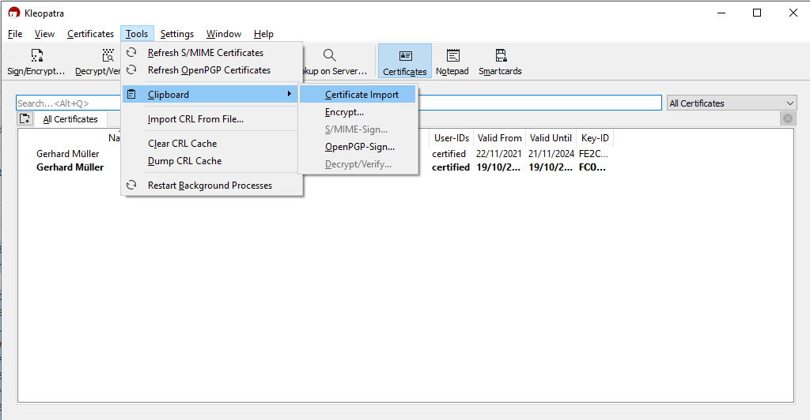
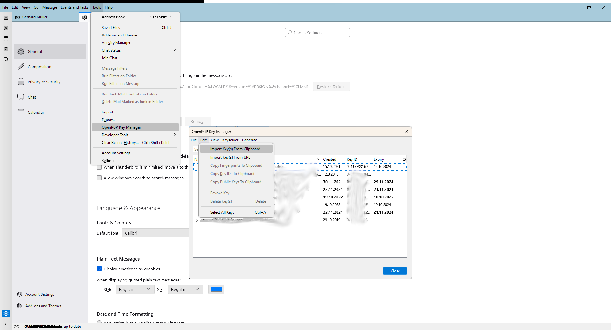

Gerhard Müller
---
My interests. My projects.

## Profession

systems engeneering

solution architecture

## Interests

Linux
 
Home automation with HomeAssistant
 
Hugo

## Others

Good Food

## Contact
    
use [PGP](.pgp/Gerhard_Mueller.asc) key. 

## PS.. 

how to import keys to [PGP4Win](https://www.gpg4win.de/) using klepoatra or thunderbird...

<!---
gerhardmueller1/gerhardmueller1 is a ✨ special ✨ repository because its `README.md` (this file) appears on your GitHub profile.
You can click the Preview link to take a look at your changes.
--->
